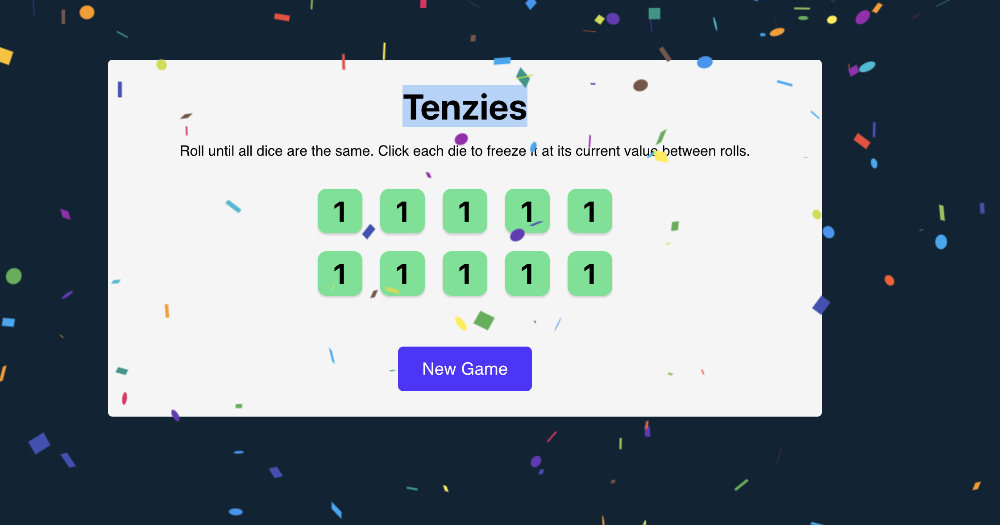

# Tenzies Game

## Available Scripts

In the project directory, you can run:

### `npm start` or by github pages

#### open [github pages](https://ayfan1.github.io/tenzies-game/)

Runs the app in the development mode.\
Open [http://localhost:3000](http://localhost:3000) to view it in your browser.

